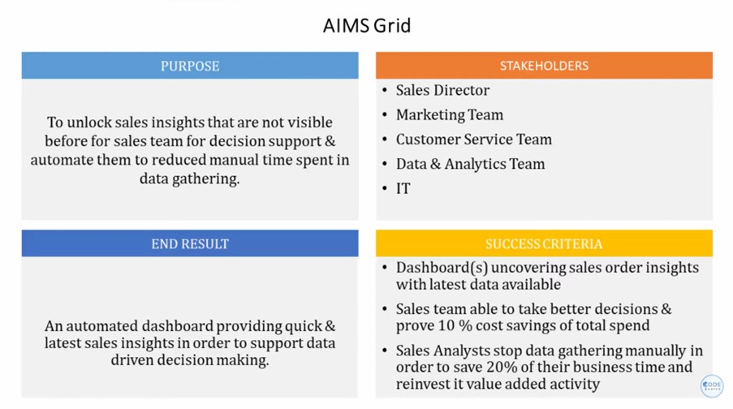

# Hardaware-Sales-insghts-dashboard

+ Sales Analytics has become a crucial tool for organizations to gain insights into their sales performance and drive data-informed decision-making.
  
+ This project focuses on revolutionizing sales management by leveraging data analytics to gain valuable insights into sales performance and market dynamics.

+ By implementing advanced data visualization techniques, we aim to provide a comprehensive overview of sales data, enabling stakeholders to make informed decisions and drive business growth.

+ Our solution bridges the gap between regional managers and the sales director, promoting transparent communication and empowering data-driven decision-making.

+ Through the integration of diverse data sources, we offer a holistic analysis of sales metrics, customer behavior, and market trends to identify growth opportunities and optimize sales strategies.

+ By developing an intuitive and user-friendly sales dashboard, we aim to enhance sales visibility, facilitate performance tracking, and enable proactive decision-making for sales teams.

+ This project will empower organizations to stay ahead of the competition, maximize revenue, and achieve sales targets by harnessing the power of data analytics and actionable insights..
## Project Flow Steps 

* <p><a href="#link1">Business Requirement Document & Data Gathering</a></p>
* <p><a href="#link2">Problem Statement</a></p>
* <p><a href="#link3">Main Goal</a></p>
* <p><a href="#link4">Data Cleaning / Data Transformation</a></p>
* <p><a href="#link5">Data Modeling</a></p>
* <p><a href="#link6">DAX</a></p>
* <p><a href="#link7">UI</a></p>

# <h2 id="link1">Business Requirement Document and Data Gathering</h2>
<br>

We are  using SQL Database provided by the client(sales director). SQL database consists of these interconnected tables, allowing the project team to gather and analyze data related to customers, dates, markets, products, and sales transactions. The data from these tables will be instrumental in uncovering valuable insights and driving data-driven decision-making for optimizing sales performance and overall business growth.

# <h2 id="link2">Problem Statment</h2>
<br>

The sales director of AtliQ hardware is struggling to understand the company's performance and address the declining sales, hindering effective decision-making.
Regional managers provide sugar-coated reports and overwhelming Excel files, making it difficult for the sales director to obtain accurate and transparent information about sales and market conditions.
<br>
 ### AIIMS Grid
  By using the AIMS grid project management tool, we made sure what are the purpose, stakeholder, end result and success criteria of our project.
  
  

  <br>

# <h2 id="link3">Main Goal</h2>
<br>

Our main goal is to develop and implement a robust sales analytics solution that empowers the sales director and stakeholders at AtliQ hardware. This solution will provide real-time visibility into sales performance, market conditions, and customer behavior. By leveraging data-driven insights, our aim is to enable informed decision-making, improve sales strategies, and drive sustainable sales growth for the company.

<br>

# <h2 id="link4">Data Cleaning / Data Transformation</h2>

The process of data cleaning and transformation is a __crucial step in preparing data__ for analysis.During the data cleaning process, we identified and filtered out any null values that were present in the dataset. This ensures that the data used for analysis and modeling is complete and reliable.

Additionally, we encountered currency values in USD within the dataset. As per the requirement, we performed a currency conversion and converted the USD values into INR (Indian Rupees) using the prevailing exchange rate 1 USD=75 INR. This allows for consistent currency representation and enables accurate analysis and comparison of sales figures in the local currency.
<br>
# <h2 id="link5">Data Modeling</h2>
<br>
In the data modeling phase, we have utilized the star schema for organizing and structuring the data. The star schema is a widely used dimensional modeling technique in data warehousing and analytics.

In this approach, we have a central fact table representing the primary focus of our analysis, such as sales transactions. This fact table contains key performance indicators (KPIs) and measures related to sales, such as revenue, quantity sold, and discounts.

Surrounding the fact table, we have multiple dimension tables representing different aspects of the sales data. These dimensions include tables like customer, product, date, and market. Each dimension table contains descriptive attributes that provide context and additional details about the corresponding aspect of the sales transaction.


# <h2 id="link6">DAX</h2>

Data Analysis Expressions (DAX) is a programming language that is used throughout Microsoft Power BI for creating calculated columns, measures, and custom tables. It is a collection of functions, operators, and constants that can be used in a formula, or expression, to calculate and return one or more values.

__Measure__

* Profit Margin Measure and the formula is : 
```
Profit Margin = divide('Base Measure'[Total Profit Margin],'Base Measure'[Revenue],0)
```

* Profit Margin Contribution measure and the formula is :

```
Profit Margin Contribution = DIVIDE([Total Profit Margin],CALCULATE([Total Profit Margin],ALL('sales customers'),ALL('sales markets'),ALL('sales products')))
```
* Revenu Contibution % measure and the formula is :

```
Revenu Contibution % = DIVIDE('Base Measure'[Revenue],CALCULATE('Base Measure'[Revenue],ALL('sales customers'),ALL('sales markets'),ALL('sales products')))
```

* Total Profit Margin and the formula is :
```
Total Profit Margin = sum('sales transactions'[profit_margin])
```
 
 _ 
<br>

# <h2 id="link7">UI/UX Design</h2>
<br>
The sales dashboard can offer a visually appealing and user-friendly experience. It will enable stakeholders to easily navigate through sales data visualizations, interact with filters and controls, and access relevant insights effortlessly. The UI/UX design ensures that the dashboard becomes an intuitive and valuable tool for decision-making, enhancing the overall effectiveness of the sales analytics solution.


<br>
